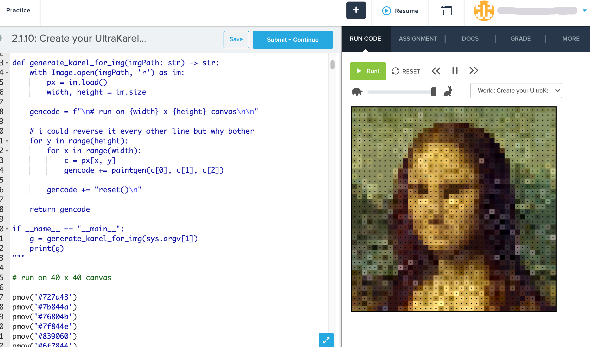

# CodeHS Karel Painter

_Written: 2021-09-01_ by @LavenderSnek

_Revised:2023-09-27_ by @Zorg-Borg


Takes any image and converts it to CodeHS Karel painting commands to recreate the image.

## Usage

Install [Pillow](https://pypi.org/project/Pillow/), run the command, 
copy all contents of the output file, and paste it into the CodeHS editor.

```
python3 karelpainter.py <image path> > temp.txt
```

## Changes
Added auto sizing images to 40x40 pixels allowing for any image to be used

Changed the hex codes to color names as codeHS changed the format for the paint command

## Background

Written for [CodeHS AP CSP Python](https://codehs.com/course/apcsp_py/lessons), Lesson 2.1 "Practice PT: Pair-Programming Paint".

The assignment was to use the CodeHS version of [Karel](https://en.wikipedia.org/wiki/Karel_(programming_language)) and make "pixel art" by individually specifying each move and color.


